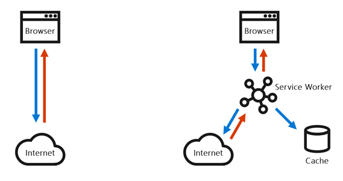
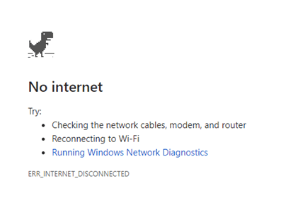
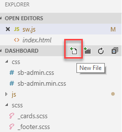
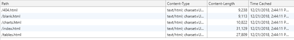
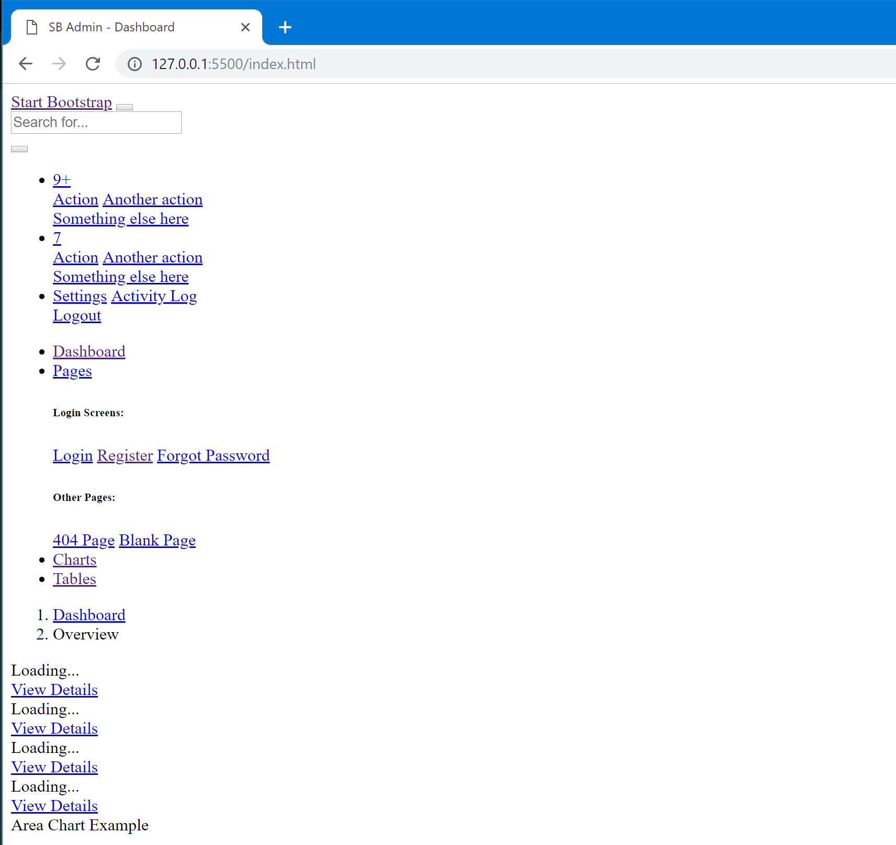
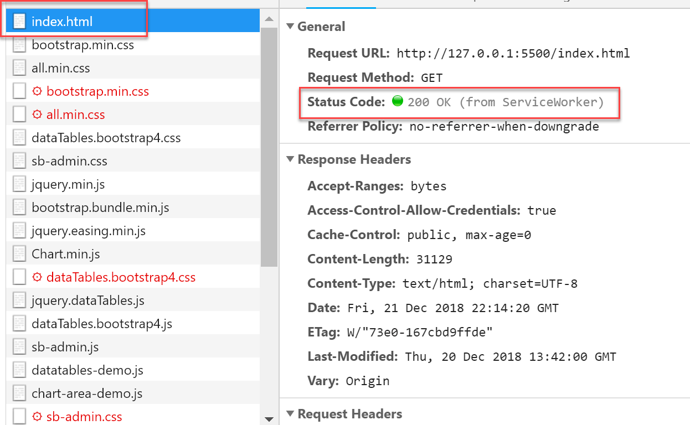
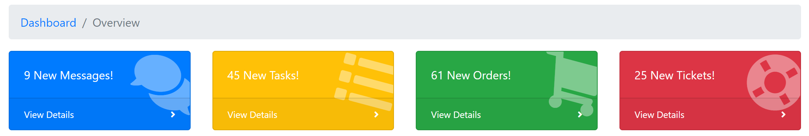
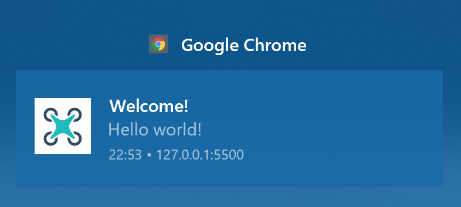

# Turn your website into a fully featured app with PWA

## Introduction

### Estimated time
90 minutes

### Objectives
- Learn how you can turn an existing website into a Progressive Web App
- Learn how to create a manifest file for your website
- Learn how to build a service worker
- Understand how a service worker can help you caching the incoming requests so that you can provide an offline experience
- Learn some of the available caching techniques
- Learn how a service worker can support push notifications
- Understand how to build a backend to send push notifications to a Progressive Web App

### Prerequisites

- Good knowledge of HTML and JavaScript
- Basic knowledge of C#

### Overview of the lab

The lab consists of three exercises, which will help you to take an existing website and gradually enhance it to turn it into a Progressive Web App. 
1. In the first exercise you will add a manifest to the website: This is a simple JSON file that describes the app. Thanks to the manifest, the browser will have the opportunity to enable advanced features, like the ability to install and use it the website even without opening the browser.
2. In the second exercise you will add a service worker which is a special JavaScript process that runs in background and acts as a middle man between the browser and the website. Thanks to the service worker, you’ll be able to implement different caching techniques, which will allow the website to be used also when you’re offline.
3. In the third and last exercise, you will leverage the service worker to add support for push notifications. Your Progressive Web App will be able to receive notifications from a backend even when the browser is closed.

### Computers in this lab
This lab uses a single Virtual Machine to provide you with the development environment.

The virtual machine is based on Windows 10 October Update (1809) and it includes:
- Visual Studio 2017
- Visual Studio Code
- Google Chrome

If you already have these tools on your computer, feel free to directly use it for the lab instead of the virtual machine. Visual Studio and Visual Studio Code are mutually exclusive. The guidance included in this lab will be focused on Visual Studio Code, but the same tasks can be achieved also with Visual Studio 2017 if you prefer.

### Scenario
Contoso Dashboard is a web application used by the Contoso internal support team to keep track of all activities that are happening inside the company. The website provides, at a glance, important information like the number of received support tickets, the open tasks, the incoming orders, the list of employees, etc.
The website is already built using the most recent best practices around web development: it's based on HTML5, JavaScript and CSS ; it offers an adaptive layout. The user interface quickly adapts to the size of the screen, so that it can be used on any device, regardless if it's a desktop machine, a tablet or a smartphone.

The development team is now looking to further enhance the website and to provide to the users a "native-like" experience, so that it could be easily installed and launched like if it's a native desktop or mobile application. Additionally, they're looking to provide offline capabilities. This way, the last updated critical information provided by the dashboard can be accessed even when the Internet connection is missing.

### The project
The Contoso Dashboard website is built using [Bootstrap](https://getbootstrap.com/), the popular web framework to build responsive web applications. It doesn't have a server-side component. The whole project runs on the client side and it's based only on HTML, CSS and JavaScript.
The data displayed in the dashboard are taken from a set of REST services, which are deployed on Azure using the Azure Functions platform. However, for the purpose of this lab, you will just consume these services and you don't have to worry how they have been implemented.

### Key concepts that will be used during the lab

#### Service Workers
In the typical web workflow, when you visit a website, there is a direct communication between the browser and Internet. The browser sends a bunch of HTTP requests to the server which replies back with the requested resources.

Service workers are a separate process, hosted by a JavaScript file, which can be installed by a website. In this scenario, the service worker is injected as a middle man between the browser and Internet. When the browser performs a HTTP request, it isn't directly sent to the server but it's intercepted first by the service worker. At this point, the service worker has the opportunity to perform different operations, based on the caching strategy we want to implement:
- We can forward the request directly to the server and then cache it
- We can try to get the resource from the cache and, only if it's missing, forward the request to the server.

During this lab we'll explore different caching techniques that can be implemented with a service worker.



Another important feature is that service workers can run in the background, even when the browser is not running. As a consequence, service workers are leveraged also to support push notifications. This way, a Progressive Web App or a website can receive notifications even when the user isn't browsing the website or while he's using another application.

#### Promises
Promises are a modern way to handle asynchronous operations in JavaScript. In the past, this scenario has typically been implemented with callbacks. You define one or more functions and then you assign them to handle different events. For example, this how you implement a HTTP request using the **XMLHttpRequest** API, which is based on the callback approach:

```javascript
function success() {
  var data = JSON.parse(this.responseText);
  console.log(data);
}

function error(err) {
  console.log('Fetch Error :-S', err);
}

var request = new XMLHttpRequest();
request.onload = success;
request.onerror = error;
request.open('get', './api/data.json', true);
request.send();
```

The API exposes two events, **onload** (which is invoked when the operation has been completed with success) and **onerror** (which is invoked when the operation has failed). The first one is associated to a function called **success()**, which takes the response and parses it; the second one, instead, triggers a function called **error** which logs the exception in the console.

This approach has multiple downsides, like:

- It's hard to understand the chain of events
- It's hard to combine multiple asynchronous events together
- Callbacks may be called before the completion of the current JavaScript run loop

A **Promise** is an object representing the completion or failure of an asynchronous operation. This is, for example, how the previous sample can be written using the new Fetch APIs, which are based on the Promise approach:

```javascript
fetch('./api/data.json')
  .then(
    function(response) {
       // Examine the text in the response
      response.json().then(function(data) {
        console.log(data);
      });
    }
  )
  .catch(function(err) {
    console.log('Fetch Error :-S', err);
  });
```

The actions that must be executed only when the operation is completed are specified inside the **then()** method. The error, instead, can be easily intercepted by chaining a **catch()** statement.
Since the **then()** method returns another promise, it's easy to chain multiple asynchronous events together. For example, in the previous sample you can notice how, if the network operation has completed successfully, we call another asynchronous method called **json()** to parse the response as a JSON document. 

We're going to heavily use promises during the lab, since all the APIs exposed by the service worker are based on this approach.

#### Fetch APIs
We have already seen this API in action talking about Promises. Fetch is a new modern API to perform HTTP operations in JavaScript. Despite the name, these APIs can be used to perform any kind of HTTP requests, not only GET but also POST, PUT, DELETE, etc.

The basic usage is quite straightforward. You pass to the **fetch()** method the URL of the resource you want to access: by default, it will be performed a HTTP GET against it. After that, you use the **then()** function to specify the tasks to perform when the operation is completed; alternatively, you can also add a **catch()** statement to intercept any error that might happen and handle it.

```javascript
fetch('./api/data.json')
  .then(
    function(response) {
       //the operation is successfull
      });
    }
  )
  .catch(function(err) {
    //the operation has failed
  });
```

Alternatively, if you need to perform more advanced operations, you have the opportunity to pass another parameter, after the URL, with more configuration options, as in the following sample:

```javascript
fetch('./api/push/savechannel', {
     method: 'post',
     headers: { 'Content-type': 'application/json' },
     body: JSON.stringify({ subscription: subscription })
});
```

In this scenario we're setting up a HTTP POST request and we're specifying its headers and body.

The fetch concept is important also when it comes to implement offline scenarios. The service worker, in fact, is able to intercept all the fetch operations performed by the website, either explicit (you call the **fetch()** method to communicate with a web service) or implicit (the browser automatically downloads a set of HTML, JavaScript and CSS resources when the website is loaded). This is a key requirement to implement offline scenarios, since it will allow us to intercept all the network operations and cache them, based on the technique we have decided to adopt.

#### Cache APIs
The Cache interface provides a storage mechanism specific for handling network requests. Its purpose, in fact, isn't to store generic key / value pairs, but specific Request / Responses object pairs. This is how caching implemented using these APIs looks like:


For each request, the Cache interface stores all the information about the HTTP request. The key identifier is the path of the resource, while the associated value is the full HTTP response, including the content.
This means that, when we load a resource from the cache, we are able to retrieve its full content, regardless if it's a HTML page, a JavaScript file, a JSON response, etc.

We're going to leverage the cache APIs in the service worker, in combination with the fetch ones. If the fetch operation fails, we're going to return the response from the cache instead than the server. However, cache APIs can be leveraged also directly from the web pages if you need to implement more complex scenarios. For example, to make the website more responsive, you could immediately load some data from the cache directly inside the page and, only later, update it with the response coming from the network.

### The tools
For this lab we're going to use [Visual Studio Code](https://code.visualstudio.com/), the popular open source and cross-platform code editor. We will use it to edit the website and to add the require code to implement the various features which will turn your website into a Progressive Web App. However, if you prefer, you can use also Visual Studio 2017.

Inside Visual Studio Code we're going to leverage also an extension called [Live Server](https://marketplace.visualstudio.com/items?itemName=ritwickdey.LiveServer), which is able to quicly spin a web server to host web applications. Thanks to this extension, we'll be able to quickly test the changes we're going to make to the website. The server supports also live reloading: every time we're going to make any change to the code of the website, the browser will be automatically reloaded.
Using this extension is very easy. Just open in Visual Studio Code the folder which contains the website and press the **Go Live** button highlighted in the image below:


The default browser of the computer will be opened directly on the website which, by default, will be hosted on the 5050 port of your local machine. 

Lastly, we're going to use [Google Chrome](https://www.google.com/chrome/) as a web browser for testing. The built-in developer tools, in fact, supports many useful features for our scenario, like displaying the registered service workers, exploring the cache, simulating the lack of Internet connection, etc.

## Exercise 2 - Adding offline capabilities
One of the key requirements to turn our Contoso Dashboard website into an application is adding offline capabilities, so that some of the available resources can be used also when the user doesn’t have an Internet connection or when he might be in a situation where the connection drops frequently (e.g. he’s in an area with a weak cellular connection).

The current web application doesn’t have any kind of offline capability. Since our website is running with a local server, it will continue to work even if we phisically disconnect our computer from Internet. However, we can test this scenario using the developer’s tools included in Chrome.

1.	Open Visual Studio Code and choose Open folder.
2.	Select the folder *add the path of the folder*, which contains the final output of Exercise 1
3.	Select the **index.html** file from the Explorer panel on the left
4.	Press the **Go live** button in the bottom taskbar of Visual Studio Code
5.	Wait for the server to start and for the website to open inside Chrome. It will be available ath the address **http://127.0.0.1:5050**. Notice that the website is loading properly, since the connection is active.
6.	Now press F12 to turn on the developer tools.
7.	Move to the **Network** tab.
8.	Click on **Offline**
9.	Reload the website. Notice how the browser is returning an error because it can’t reach the server anymore.



### Task 1 - Add a service worker
As already mentioned at the beginning of the lab, the Service Worker is a component that acts as a middle man between the browser and the server. When a website registers a service worker it’s able to intercept all requests, so that it can redirect them to the most appropriate source: Internet or the browser’s cache.

Let’s start to add a basic service worker to our Contoso Dashboard website. 

1. Go back to Visual Studio Code and press the **New file** button in the Explorer panel.

    

2. Name it **sw.js**
3. For the moment, we aren't going to implement any special caching strategy. We're just going to forward all the incoming requests to the server. Copy and paste the following snippet inside the **sw.js** file:

    ```javascript
    self.addEventListener('fetch', function (event) {
        event.respondWith(fetch(event.request));
      });
    ```
    
    We subscribe to the **fetch** event, which is triggered every time the browser performs a HTTP request against the server. Thanks to the **event.respondWith()** function we intercept the operation. This way, the browser won't try to handle it, but it will be up to us to do it. However, in this case we are behaving like the browser, so we simply invoke the **fetch()** method passing, as parameter, the original request. This way, it will simply be forwarded to the server.

4.	Now expand the **js** folder in the Explorer panel and press again the **New file** button. Name it **sb-pwa.js**. This is the file where we're going to implement all the logic to register the service worker.
5.	Copy and paste the following code snippet:

    ```javascript
    if (navigator.serviceWorker.controller) {
      console.log('[PWA Builder] active service worker found, no need to register');
    } else {
      //Register the ServiceWorker
      navigator.serviceWorker.register('sw.js', {
        scope: './'
      }).then(function(reg) {
        console.log('Service worker has been registered for scope:'+ reg.scope);    
      });
    }
    ```

    This code first checks if a Service Worker is already registered, by checking if **navigator.serviceWorker.controller** exists. If that’s the case, we don’t have to do anything. Otherwise, we move on with the registration process by calling the **navigator.serviceWorker.register()** method, which requires two parameters:
    - The filename of the JavaScript file which will act as a service worker. The path should be relative to the root of the website. We specify the name of the file we have previously created, which is **sw.js**.
    - A set of additional parameters for the configuration. The key one is called **scope**, which specifies the resources the service worker will be able to access to. Since we want to handle the whole website, we have placed the sw.js file in the root and we specify **./** as scope. 
    The **register()** method is asynchronous and it’s based on the promises approach. As such, we can use the **then()** function to chain another operation which must be executed once the operation has been completed. In our case, we just log a message in the browser’s console.
6. Go back to the Explorer panel of Visual Studio Code and choose the **index.html** file. Move to the bottom of the page and, before the closure of the **body** tag, register the script you have just created:

```html
<script src="js/sb-pwa.js"></script>
```


That’s it! If you want to test that the service worker has been installed properly, open the URL **http://127.0.0.1:5050** in Chrome and press F12 to enable the developer tools. Move to the **Application** tab and you should see something like this:


The service worker has been properly installed and it’s up and running. We can verify that it's indeed acting as a middle man between the browser and the server by moving to the **Network** tab and reloading the page. You will notice that all the request will be coming from the service worker and not directly from the server:


However, the current implementation of the service worker is not really useful. We're just forwarding all the incoming requests to the server, which is something the browser would do anyway.
Let's move to the second task to start adding offline capabilities.

### Task 2 - Enable caching at install time
A common scenario for a Progressive Web App is to cache, immediately when the service worker is installed for the first time, a set of pages that could be commonly visited by the user or which content could be leveraged also offline.

Let’s take a look at the structure of our web application in the Explorer panel of Visual Studio Code:


We can identify the following HTML pages:

- 404.html
- blank.html
- charts.html
- forgot-password.html
- index.html
- login.html
- register.html
- tables.html

> Can you identify which are good candidates for being cached when the service worker is installed?

Here is the list with, highlighted in bold, the pages which should be cached when the service worker is installed:

- **404.html**
- **blank.html**
- **charts.html**
- forgot-password.html
- **index.html**
- login.html
- register.html
- **tables.html**

These are the pages that contains information which are relevant also in an offline scenario. All the others aren’t a good candidate since they are dedicated to perform actions (logging in, registering a new account, etc.) which would be impossible to complete anyway without an Internet connection.

Let’s define a new function to cache these pages inside the service worker:

1.	Open in Visual Studio Code the **sw.js** file
2.	Copy and paste the following snippet at the beginning of the file:

    ```javascript
    var preLoad = function(){
      console.log('[PWA Builder] Install Event processing');
      return caches.open('pwabuilder-offline').then(function(cache) {
        console.log('[PWA Builder] Cached index and offline page during Install');
        return cache.addAll(
          [
            '/index.html', 
            '/404.html', 
            '/blank.html', 
            '/charts.html',
            '/tables.html'
          ]);
      });
    }
    ```
    
    This code uses the cache APIs to open the cache we have created for our application, by using the **open()** method exposed by the **caches** object. The name of the cache doesn’t have to follow a specific naming convention, you can use the one you prefer. In our case, we're using **pwabuilder-offline**. This method will create the cache if it doesn't exist, so it's safe to call it even if it's the first time the web application is opened. When the operation is completed with success, we can move on and store some pages using the **addAll()** method, passing as parameter an array of strings with the list of pages we want to include in the cache.
    
3.	The next step is to invoke the above function as soon as the service worker is installed. We can use one of the events exposed by the service worker, called install. Copy and paste the follow snippet before the **preLoad()** function:

    ```javascript
    self.addEventListener('install', function(event) {
        event.waitUntil(preLoad());
      });
    ```
    
    The **waitUntil()** method exposed by the event APIs is used to tell to the browser that work is ongoing until the promise settles, and it shouldn't terminate the service worker if it wants that work to complete. This way the **preLoad()** function will be invoked as soon as the service worker is deployed and the caching operation won’t be aborted as long as it’s still running.

4.	Now return to Chrome, make sure it’s still open on the website and that the developers tools are turned on. 
5.	Move to the **Application** tab and press **Unregister** near the service worker. Then close Chrome. This step will make sure that the updated service worker will be deployed and it will replace the old one.
6.  Open again Chrome on the Contoso Dashboard website. In case you need it, remember that the URL of the local server is **http://127.0.0.1:5050**
7.	Press again F12 and open the developer tools. Move again to the **Application** tab.
8.	Expand the **Cache** section: you should see a cache with the same name you have defined in the JavaScript code, which is **pwabuilder-offline**. On the right, you will see all the content that has been cached.
9.	Notice how, despite you have visited only the main page of the websites, also other pages have been cached:

    
    
    These are the pages that we have manually added to the cache when the service worker has been installed.

However, the code we have written so far isn't enough. If we move to the **Network** tab, we enable the **Offline** option and we reload the website we will see the same offline browser error.

> Can you guess why is it happening?

The code we have written simply takes care of adding the desired pages in the cache, but the event handler of the **fetch** event is still the same. As such, all the incoming requests are directly forwarded to the web server.

We need to change the current handler of the **fetch** event in a way that, if the request can't be forwarded to the server, it will be returned from the cache.

1. Open again the **sw.js** file in Visual Studio Code
2. Look for the snippet we have previously added to handle the **fetch** event and delete it
3. Copy and paste the following new handler:

    ```javascript
    self.addEventListener('fetch', function(event) {
      event.respondWith(
        fetch(event.request)
        .catch(function (error) {
          return caches.open('pwabuilder-offline').then(function (cache) {
            return cache.match(event.request).then(function (matching) {
              var report =  !matching || matching.status == 404 ? cache.match('offline.html'): matching;
              return report;
            });
          });
        })
      );
    });
    ```
    We are still intercepting the browser request with the **event.respondWith()** method and we're still forwarding it directly to the server with the **fetch()** API. However, we have added a **catch()** handler, which is triggered in case the connection to the server fails.
    In this scenario we use the **caches.open()** method to get access to the cache we have created when we have registered the service worker. Then, using the **cache.match()** method, we look if the current request is available inside the cache. If you remember what we have explained in the introduction, the caching interface uses a key / value pair implementation where the key is the request itself. As such, we use the **event.request** property as identifier. In case we get a match, we return the cached response. Otherwise, we will redirect the user to a dedicated offline page called **offline.html**.

It's now time to test the code:

1. Open Chrome, make sure it’s still open on the website and that the developers tools are turned on. 
2. Move to the **Application** tab and press **Unregister** near the service worker. Then close Chrome. This step will make sure that the updated service worker will be deployed and it will replace the old one.
3. Open again the Chrome on the Contoso Dashboard website. In case you need it, remember that the URL of the local server is **http://127.0.0.1:5050**
4. Press F12 and open the developer tools.
5. Move to the **Applications** tab and make sure to select the **Service Workers** tab. 
6. Check the **Offline** option.
7. Now reload the website again. You will see something similar to the image below:



Compared to the previous tests, this time we're indeed getting something back and we aren't seeing anymore the offline error message provided by the browser. However, the outcome isn't really exciting.

> Can you guess why we are seeing a broken page?

When we have registered the Service Worker, we have cached only the HTML pages. However, the Contoso Dashboard application is composed also by styles defined in CSS files; or by scripts stored in JavaScript files. None of them has been added in the cache.

We can verify that this is indeed the case with the developer tools. Move to the **Network** tab. You will notice how the **index.html** is indeed being returned by the Service Worker, while all the other requests are failing:



A way to solve this problem would be to update the Service Worker initialization code in order to register all the other files which are required to properly render the web application. However, woudln't be simpler if we just add all the incoming requests to the cache? This is what we're going to implement in the next task.

### Task 3 - Enable cache at request time
In the previous task we have intercepted the **fetch** event to handle caching. However, we were focused only in reading from the cache. If the current request couldn't be satisfied because the Internet connection was missing, we tried to read it from the cache.

However, this event can be used also to write to the cache. This is what we're going to do in this task. Whenever the browser sends a request to the server and it's succesfull, we're going to save the response in the cache. This way, if the connection drops, we will be able to provide an offline experience not only for the pages we have cached in the beginning, but also for all the other resources that are downloaded while the user browses the web application.

1. Open the **sw.js** file in Visual Studio Code
2. Look for the function which handles the **fetch** event we have created in task 2 and delete it.
3. Copy and paste the following code in replacement:

    ```javascript
    //If any fetch fails, it will look for the request in the cache and serve it from there first
    self.addEventListener('fetch', function(event) {
      var updateCache = function(request){
        return caches.open('pwabuilder-offline').then(function (cache) {
          return fetch(request).then(function (response) {
            console.log('[PWA Builder] add page to offline '+response.url)
            return cache.put(request, response);
          });
        });
      };
    
      event.waitUntil(updateCache(event.request));
    
      event.respondWith(
        fetch(event.request).catch(function(error) {
          console.log( '[PWA Builder] Network request Failed. Serving content from cache: ' + error );
    
          //Check to see if you have it in the cache
          //Return response
          //If not in the cache, then return error page
          return caches.open('pwabuilder-offline').then(function (cache) {
            return cache.match(event.request).then(function (matching) {
              var report =  !matching || matching.status == 404 ? cache.match('offline.html'): matching;
              return report;
            });
          });
        })
      );
    });
    ```
    
    The main part of the snippet is the same we have created in task 2. When the **fetch** event is raised, we intercept the request and, in case the connection fails, we look if it was already cached. If yes, we return it; otherwise, we redirect the user to the offline page.
    
    However, inside the event handler we have defined also a new function called **updateCache()**. This operation does the opposite process: it sends the request to the server, it takes the response and, by using the **put()** method offered by the **cache** object, it stores it inside the cache.
    
    The **updateCache()** function is then invoked using the **event.waitUntil()** method. This approach makes sure that the operation doesn't get terminated until the response has been properly stored in the cache.
    
Let's test the new behavior.

1. Open Chrome, make sure it’s still open on the website and that the developers tools are turned on. 
2. Move to the **Application** tab and press **Unregister** near the service worker. Then close Chrome. This step will make sure that the updated service worker will be deployed and it will replace the old one.
3. Open again the Chrome on the Contoso Dashboard website. In case you need it, remember that the URL of the local server is **http://127.0.0.1:5050**
4. Press F12 and open the developer tools.
5. Move to the **Applications** tab and expand the **Cache Storage** element in the left panel
6. Click on the available cache, named **pwabuilder-offline**.
7. Observe, in the center of the panel, the content of the cache. As you can see, now it contains many more items and not just the pages that are cached when the Service Worker is installed for the first time.

    

8. Stay in the **Applications** tab of the developer tools and choose, this time, **Service Worker**.
9. Check **Offline** at the top of the panel.
10. Now reload the page. You will notice that, this time, the offline page will look exactly like the online one, without errors or noticeable issues. The reason is that, this time, also all the required CSS and JavaScript files have been cached and not just the HTML ones.

### Task 4 - Cache specific requests (optional tasks)

Caching doesn't work only with standard web resources like HTML pages or CSS files, but with any HTTP request, including the output of REST services.
We can see an example in the Contoso Dashboard application. The main page includes 4 boxes, which display in real time the status of various activities happening inside the company.



The information displayed in these boxes is retrieved from a REST service exposed on Internet.


1. Open the **sb-admin.js** file, placed inside the **js** folder of the project. 
2. Look for the a snippet of code below, which is used to update the messages box (the blue one):

    ```javascript
    $(document).ready(function() {
    
        var baseUrl = 'https://ready2019-pwa.azurewebsites.net';
    
        fetch(baseUrl + '/api/messages')
        .then(json)
        .then(function (data) {
          $('#messages').html(data.count + " New Messages!");
        });
    }
    
    function json(response) {
    return response.json();
    }
    
    ```

    By using the **fetch()** method we connect to the REST service, we download its content, we parse it as a JSON and we extract the total number of messages (which is stored in the **count** property). By using the jQuery syntax, we update the content of the box with id **messages** to display the returned value.
3. Open Chrome, make sure it’s still open on the website and that the developers tools are turned on. Otherwise, digit the URL **http://127.0.0.1:5050** in the address bar and open it.
4. Press F12 to turn the developer tools and move to the **Application** tab.
5. Expand the **Cache Storage** section in the left panel and click on the available cache, which name is **pwabuilder-offline**.
6. Scroll the list of cached resources and notice how, other than the standard web resources like HTML pages and CSS files, you will see the various calls made to the REST APIs to retrieve the information displayed in the boxes.
7. Click on the **/api/messages** cached resource and notice how it contains the JSON downloaded from the REST service.


8. You can test that the request is being succesfully cached by observing the different behavior when you're online or offline:
- If you're online, every time you refresh the page the number in the various boxes will change, since it's returned by the REST API
- If you're offline, at every refresh of the page the number in the various boxes will stay the same, since it's returned by the local cache

The current behavior provides a good user experience, but there's space for improvement. If the user has a slow Internet connection, he will be stuck on the **Loading...** message until the response from the REST API is returned.

> Can you guess a way to improve the user experience and make the website even more responsive?

We can check if the response from the REST API is stored in the cache. If that's the case, we can immediately display it and update the value only once we have retrieved a fresh response from the server. However, the Service Worker isn't the right place where to implement this technique. We want to implement this behavior only for the values returned by the REST API. We don't want the whole website to adopt this "cache first, network later" technique.

As such, we can change the function which interacts with the REST API to leverage the cache directly in the main website.

1. Open the **sb-admin.js** file in the **js** folder.
2. Look for the following snippet of code:

    ```javascript
    fetch(baseUrl + '/api/messages')
            .then(json)
            .then(function (data) {
              $('#messages').html(data.count + " New Messages!");
            });
    ```
3. Delete it and replace it with the following code:

    ```javascript
    caches.open('pwabuilder-offline')
    .then(function (cache) {
      cache.match(baseUrl + '/api/messages')
      .then(json)
      .then(function (data) {
            $('#messages').html(data.count + " New Messages!");
          });
      })
      .then (function() {
        fetch(baseUrl + '/api/messages')
        .then(json)
        .then(function (data) {
          $('#messages').html(data.count + " New Messages!");
        });
    ```
    
    Before performing the fetch operation to retrieve the data from the REST service, we open the cache and we look if we have already previously cached the request. The main difference compared to the code we have written in the Service Worker is that, this time, we aren't generically handling all the requests, but only a specific one: the one which responds to the **/api/messages** endpoint of our REST service. If that's the case, we parse the JSON and we immediately display the value in the box in the page (the one identified by the **messages** id). Once we have performed the operation, the rest of the code is the same as before and it downloads a fresh copy of the data from the web service.
4. Let's test the code now. Open Chrome, make sure it’s still open on the website. Otherwise, digit the URL **http://127.0.0.1:5050** in the address bar and open it.
5. Refresh the home page a few times. You will notice that the last value returned by the REST service will be immediately displayed. Once the communication with the REST service is completed, the box will be updated to reflect the new value.

## Exercise 3 - Adding push notifications
One of the features mostly frequented adopted by mobile application are push notifications. Since in the mobile ecosystem applications aren't meant to be always running, you need to notify to the user when something important happened even if the application isn't active.

Push notifications are the best way to achieve this goal, since they are optimized to have a low impact on the battery life ot the device. In a push notification architecture, the application doesn't have to keep polling the server to check for notifications. It simply register a channel, which the server will reach whenever it has a notification to send to the user with a simple HTTP request.

In a typical notification scenario, we have 3 actors involved:

- The client, which is the mobile or desktop application. It takes care of creating a notification channel and sharing it with the backend. Then it goes dormant waiting to receive notifications.
- The backend, which is the server side application that sends the notification. The backend holds the information when it's the right time to send a notification, based on the scenario. For example, a sport application may send a notification every time one of the teams has scored a goal. The backend stores also the list of all the channels coming from the client application, with one or more information to identify the user. This way, the backend knows not only the right time, but also the right users who will receive the notification. The sport application, for example, may send a goal notification only to the users who are interested in following one of the teams that has scored.
- The push notification service. This service acts as a middle man between the client and the backend. The backend won't talk directly to the client, but it will send the HTTP request to the service, which will take care of converting it into a  notification and route it to the right device. Being the point of connection between devices and the backend, each mobile platform offers its own service. Android leverages the [Firebase Cloud Messaging](https://firebase.google.com/docs/cloud-messaging/) service; iOS uses the [Apple Push Notification service](https://developer.apple.com/library/archive/documentation/NetworkingInternet/Conceptual/RemoteNotificationsPG/APNSOverview.html#//apple_ref/doc/uid/TP40008194-CH8-SW1); Microsoft, in the end, offers the [Windows Push Notification service](https://docs.microsoft.com/en-us/windows/uwp/design/shell/tiles-and-notifications/windows-push-notification-services--wns--overview) for Windows devices. All these services implements an authentication process, in order to avoid that a random actor may send notifications to a device just by discovering the channel's URL. As a consequence, when you want to implement push notifications in am application, you typically have to register it in a portal provided by the platform owner, so that you can get the credentials required to authenticate against the service.

However, our scenario is slightly different. We have built a web application, which is platform agnostic. As such, having to implement a different backend for each desktop and mobile platform on the market would be quite expensive.
The solution is to use Web Push notifications, which are based on two standard W3C features: 

- [Notifications APIs](https://www.w3.org/TR/notifications/), which take care of rendering the notifications
- [Push APIs](https://www.w3.org/TR/push-api/), which take care of requesting a channel, handling the incoming notifications, etc.

Being based on a standard definition, they are implemented by the latest version of all the major browser on the market.

The biggest difference compared to the mobile architecture we have seen is that we won't have to register on different services, based on the platform where the website is running. All the major push notification service on the market, in fact, have added support to the web push standard. As such, the user's browser will automatically leverage the most appropriate service: if you're using Chrome, the channels will be registered on FCN; if you're using Edge, on WNS; etc.

The only information you'll need is a set of credentials called **application server keys** or **VAPID keys**, since they need to follow [the VAPID specs](https://tools.ietf.org/html/draft-thomson-webpush-vapid). VAPID keys are composed by a public key, which will be used by the browser to request a subscription channel, and a private key, which will be used by your backend to authenticate the request and send the notification. When the browser receives the notification, it will decrypt and, only if it's successful, he will display it to the user. During this lab, we're going to learn how to get a valid pair of keys.

Push notifications are tightly coupled with a concept we've already seen in the other exercises: service workers. Since this component is registered inside the system and it can run also in background, when the browser is not running, they're the perfect candidate to handle push notification. Service workers, in fact, offer all the APIs to subscribe to the push notification service, to handle the incoming requests, to display the notifications, etc.

### Task 1 - Subscribe to receive push notifications
Notifications are represented by a JSON payload, which is included in the body of the HTTP request that the backend sends to the notification service.
In case of web notifications, this is how a typical JSON payload looks like:

```json
{
  "body": "Did you just made a purchase using your credit card ending with 1234?",
  "icon": "images/ccard.png",
  "vibrate": [200, 100, 200, 100, 200, 100, 400],
  "tag": "request",
  "actions": [
    { "action": "yes", "title": "Yes", "icon": "images/yes.png" },
    { "action": "no", "title": "No", "icon": "images/no.png" }
  ]
}
```

However, the browser isn't able to handle push notifications on its own. We have to listen for incoming notifications in our web application and use the information in the provided JSON to visually render it.
We're going to do this operation in the service worker since, as already explained, it's able to run also in background when the browser isn't running.

**Please note**. If you have finished Exercise 2, you can use the outcome as starting point. Otherwise, you can use the website included in the folder **Exercise 2/Start**.

1. Open the folder which contains the website in Visual Studio Code.
2. Select the **sw.js** file in the Explorer panel on the left.
3. Add the following snippet at the end of the file:

    ```javascript
    self.addEventListener('push', function (event) {
      var data = JSON.parse(event.data.text());
    
      event.waitUntil(
          registration.showNotification(data.title, {
              body: data.message,
              icon: "/images/contoso.jpg"
          })
      );
    });
    ```

    The code registers for the **push** event, which is triggered by the service worker whenever there's a new incoming notification. After having parsed the JSON with the incoming request, we use the **registration.showNotification()** method to actually show the notification. As we already did multiple times in Exercise 2, we embed this method inside the **event.waitUntil()** statement to make sure that the browser doesn't terminate the service worker until the notification has been displayed. The **showNotification()** method requires as parameters the title and the structure of the notification. In this case, we are displaying a very simple notification and, as such, we just fill the **body** and the **icon** properties. The first one is filled with data coming from the JSON, while the second one is a fixed path.
    
This is all the code we need to handle incoming push notifications. Chrome gives us the opportunity to test the implementation thanks to the developer tools.

1. In case the web server isn't running, press the **Go live** button in the bottom task bar of Visual Studio Code
2. Wait for Chrome to open on the website. If it doesn't happen, you can manually open Chrome and type the URL **http://127.0.0.1:5050** in the address bar.
3. Press F12 to open the developer tools. If you are using a instance of the browser you already used for previous exercises, move to the **Application** tab, choose **Service Workers** from the left panel and press **Unregister** near the service worker. Then close Chrome and reopen it on the same website. This step will make sure that the updated service worker will be deployed and it will replace the old one. 
4. In the developer tools, click on **Application**, then choose **Service Workers**.
5. Notice that, in the center, there's a **Push** field under the information about the service worker.
6. In the field you can specify the JSON payload of a push notification. Add the following one:

    ```json
    { "title" : "Welcome!", "message": "Hello world!" }
    ```

    

7. Press the **Push** button.
8. If you have done everything correctly, the notification should pop up and then stored in the Action Center of Windows 10.

    

The event we have registered in the service worker is working as expected. However, the current implementation isn't really useful. The notification is displayed only locally and when the website is up & running. In a real push notification scenario, we need to subscribe to a channel and to implement a backend to store them.

This will be our goal in the next excercise.
    


